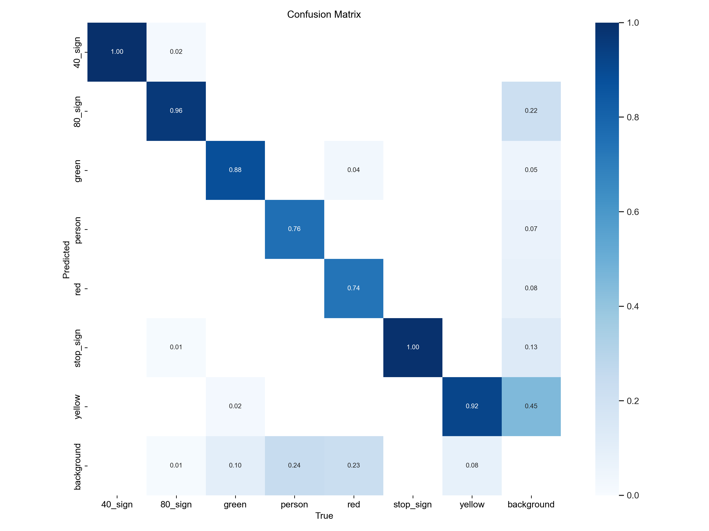
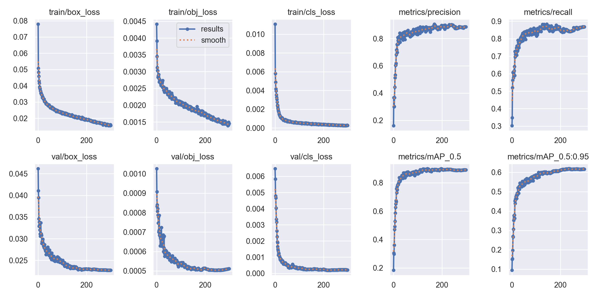
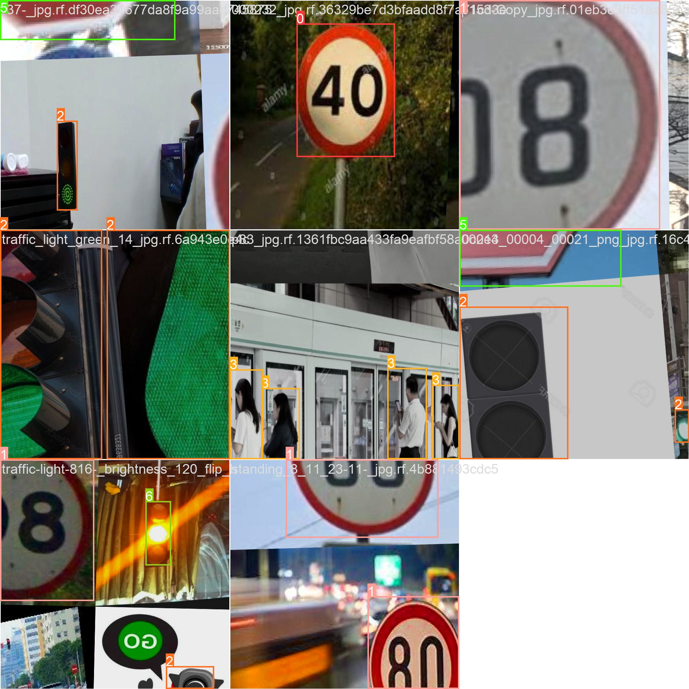

# 실시간 차량 카메라 객체 탐지 YOLO 모델 개발 프로젝트

전이학습으로 YOLOv5 기반의 신호등, 표지판 그리고 보행자 탐지 모델을 개발했습니다.   

## 구성도
```   
├── models/             
├── utils/       
├── assets/          (모델 관련 시각 자료 및 로그 파일)       
├── detect.py        (실행 파일)    
├── .gitignore
├── requirements.txt (설치 라이브러리 목록)   
├── weights/         
│   └── best.pt      (학습 모델 산출본)
├── data/
│   └── traffic.yaml (데이터 학습 경로 파일)     
└── README.txt       
```

## 프로젝트 개요
* 기간 : 2025.11.28 - 2025.12.13
* 목표 : 도심 주행 환경에서 신호등과 보행자 및 표지판 실시간으로 검출
* 사용 모델 : YOLO5s
* 팀원 역할 (4명) :
    * 이성재 (팀장) : 보고서 작성 및 표지판 학습 데이터 수집 및 증강
    * 손혜성 : 실제 모델 학습 및 하이퍼파라미터 튜닝 (configs/custom_hyp.yaml)
    * 홍정표 : 보행자, 초록, 빨강 신호등 학습 데이터 수집
    * 왕민 : 학습 데이터 라벨링 수정 및 노랑 신호등 학습 데이터 수집


### 클래스 종류
* red (빨강 신호등)
* yellow (노랑 신호등)
* green (파랑 신호등)
* person (보행자)
* stop_sign (정지 표지판)
* 80_sign (80 속도 제한 표지판)
* 40_sign (40 속도 제한 표지판)

## 성능
| Confusion Matrix |
| :---: |
|  |   

| Training Results (mAP) |
| :---: | 
|  |   

### 실제 객체 탐지 결과


## 모델 실행
모델을 실행시키기 전, 아래의 명령어를 통해 필요한 라이브러리를 설치합니다.

```
pip install -r requirements.txt
```
폴더 내에서 아래와 같이 프롬프트를 작성하면 컴퓨터 카메라로 모델을 돌려볼 수 있습니다.
```
python detect.py --source 0 --weights weights/best.pt
```

Acknowledgement This project is based on YOLOv5 by Ultralytics, licensed under AGPL-3.0.